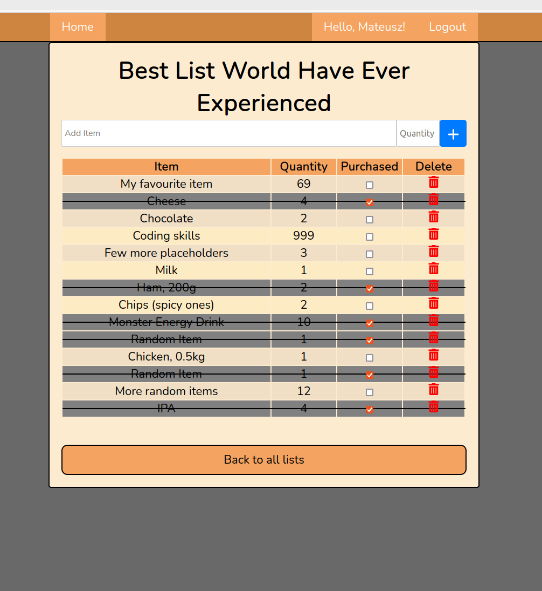

<i>*work in progress</i>

<h1 align="center"><strong>Shopping List</strong> project</h1>

## Description

I just want to learn a few things about building REST API. I have decided to start with the backend part and later on I will figure out the frontend part. 
Let's see what has been done so far.

## Backend
### Technologies:
- **Framework:** Django (REST framework)
- **Language:** Python (3.12)
- **Database:** PostgreSQL
- **Serialization to:** JSON
- **Other**: Postman, pytest/pytest-django, venv

### Tests
All the test have been done using pytest/pytest-django. For more information go to `ShoppingList/tests.py` and `ShoppingList/conftest.py` or `Accounts/tests.py` and `Accounts/conftest.py`.
Additionally, manual tests were performed using Postman to validate various request types on different endpoints.

## Frontend
~~Once I learn either React, Angular or Vue I will start working on the Frontend part of the app.~~ 

Ok, I have decided to learn React for the start. 

### Technologies:
- **Framework:** React: CRA
- **Language:** JS (ES6+), HTML (JSX), CSS,
- **Other**: Axios, React Router, Context API, Font Awesome

### Tests
TBD soon
<i>(Most likely Jest)</i>

## Setup
<i>This project will be packaged into Docker once both the backend and frontend are complete. For now, to use the backend part and most of the frontend, follow the instructions below.</i>

<i>Note: All endpoints require the user to be logged in (except for registration and login), so you need to use either curl or Postman to interact with them.</i>

#### Backend:
1. Clone the repository.
2. Set up virtual environment `python -m venv .venv`, activate it `source .venv/bin/activate ` and install dependencies `pip install -r requirements.txt`.
3. Change `.env.example` name to `.env` and make needed adjustments.
4. Set up your DB.
5. Run the command `python manage.py runserver` to start backend part.

#### Frontend
1. Clone the repository.
2. Run the command  `npm start` to start frontend part and have fun.

## Visualisation

List of shopping lists:

List of items in the individual shopping list:

## License
You are free to use, modify, and distribute this application for your private, personal use.

## Author
- **email**: mateusz.marciszm@gmail.com
- **github**: [MateuszMarcisz](https://github.com/MateuszMarcisz)
- **CodeWars**: [T0dl3r](https://www.codewars.com/users/T0dl3r)
- **GS**: [GoogleScholar](https://scholar.google.com/citations?user=QW3tlewAAAAJ&hl=en)